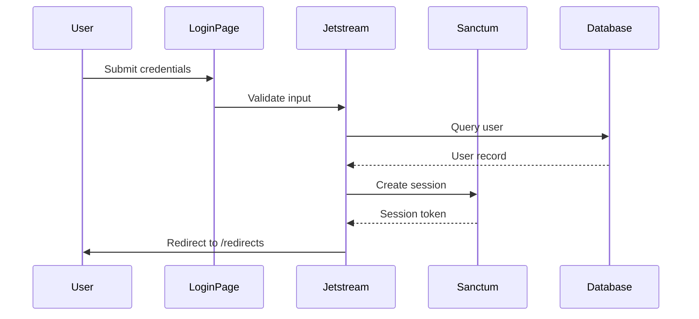

## Overview

The Restaurant Management System uses **Laravel Sanctum** with **Jetstream (Livewire stack)** for authentication. The system implements role-based access control (RBAC) using a combination of **Spatie Laravel Permission** package and custom middleware.

<Note>
  Authentication is session-based for web routes using Laravel's built-in session driver. Sanctum also supports API token authentication for external integrations.
</Note>

## Authentication Stack

### Laravel Sanctum Configuration

Located in `config/sanctum.php`:

```php
return [
    'stateful' => explode(',', env('SANCTUM_STATEFUL_DOMAINS', 
        'localhost,localhost:3000,127.0.0.1,127.0.0.1:8000,::1'
    )),
    
    'guard' => ['web'],
    
    'expiration' => null, // Tokens never expire by default
    
    'middleware' => [
        'authenticate_session' => Laravel\Sanctum\Http\Middleware\AuthenticateSession::class,
        'encrypt_cookies' => App\Http\Middleware\EncryptCookies::class,
        'verify_csrf_token' => App\Http\Middleware\VerifyCsrfToken::class,
    ],
];
```

### Jetstream Configuration

Located in `config/jetstream.php`:

```php
return [
    'stack' => 'livewire', // Using Livewire stack
    
    'middleware' => ['web'],
    
    'auth_session' => AuthenticateSession::class,
    
    'guard' => 'sanctum',
    
    'features' => [
        Features::accountDeletion(),
        // API features disabled by default
    ],
];
```

<Warning>
  Jetstream API features are currently disabled. To enable API token generation, uncomment `Features::api()` in the configuration.
</Warning>

## User Model

The User model (`app/Models/User.php`) implements multiple traits:

```php
use Laravel\Sanctum\HasApiTokens;
use Spatie\Permission\Traits\HasRoles;

class User extends Authenticatable
{
    use HasApiTokens, HasFactory, Notifiable, HasRoles;
    
    protected $fillable = [
        'name',
        'email',
        'password',
    ];
    
    protected $hidden = [
        'password',
        'remember_token',
    ];
    
    protected $casts = [
        'email_verified_at' => 'datetime',
        'password' => 'hashed',
    ];
}
```

### Key Traits

- **HasApiTokens**: Enables Sanctum token authentication
- **HasRoles**: Provides Spatie Permission integration for role management
- **Notifiable**: Enables notification sending

## Authentication Guards

Configured in `config/auth.php`:

```php
'defaults' => [
    'guard' => 'web',
    'passwords' => 'users',
],

'guards' => [
    'web' => [
        'driver' => 'session',
        'provider' => 'users',
    ],
],

'providers' => [
    'users' => [
        'driver' => 'eloquent',
        'model' => App\Models\User::class,
    ],
],
```

## Role-Based Access Control

The system implements RBAC using four primary roles:

1. **Admin** - Full system access
2. **Chef** - Menu management and profile
3. **Mesero** - Table and reservation management
4. **Customer** - Authenticated user (default)

### User Type Field

Users have a `usertype` column that stores their role:

- `'admin'`
- `'chef'`
- `'mesero'`
- `null` or `'customer'` (default)

## Authentication Middleware

### 1. Authenticate Middleware

Located at `app/Http/Middleware/Authenticate.php`:

```php
class Authenticate extends Middleware
{
    protected function redirectTo(Request $request): ?string
    {
        return $request->expectsJson() ? null : route('login');
    }
}
```

**Behavior**:
- Unauthenticated web requests → Redirect to `/login`
- Unauthenticated JSON requests → Return `null` (401 response)

**Usage**:
```php
Route::middleware(['auth'])->group(function () {
    // Protected routes
});
```

### 2. RoleMiddleware (Primary)

Located at `app/Http/Middleware/RoleMiddleware.php`:

```php
class RoleMiddleware
{
    public function handle(Request $request, Closure $next, ...$roles)
    {
        $user = Auth::user();
        
        if (!$user) {
            abort(403, 'No tienes permiso para acceder a esta página. (no-auth)');
        }
        
        // Normalize roles: handles 'admin,chef,mesero' or ['admin','chef']
        $normalized = collect($roles)
            ->flatMap(function ($r) {
                return array_map('trim', explode(',', $r));
            })
            ->filter()
            ->unique()
            ->values()
            ->all();
        
        // Check Spatie roles if available
        if (method_exists($user, 'hasAnyRole')) {
            if ($user->hasAnyRole($normalized)) {
                return $next($request);
            }
        } else {
            // Fallback to usertype column
            if (in_array($user->usertype, $normalized, true)) {
                return $next($request);
            }
        }
        
        abort(403, 'No tienes permiso para acceder a esta página. (sin-rol)');
    }
}
```

**Key Features**:
- Supports multiple roles: `role:admin,chef,mesero`
- Dual strategy: Spatie roles OR usertype fallback
- Flexible role parsing (comma-separated or array)

**Usage Examples**:

```php
// Single role
Route::middleware(['auth', 'role:admin'])->group(function () {
    // Admin only
});

// Multiple roles
Route::middleware(['auth', 'role:admin,chef'])->group(function () {
    // Admin or Chef
});

// Nested groups with different permissions
Route::prefix('admin')
    ->middleware(['auth', 'role:admin,chef,mesero'])
    ->group(function () {
        
        // All panel users can access dashboard
        Route::get('/dashboard', [DashboardController::class, 'index']);
        
        // Only admins
        Route::middleware('role:admin')->group(function () {
            Route::resource('users', UserController::class);
        });
        
        // Admins and chefs
        Route::middleware('role:admin,chef')->group(function () {
            Route::resource('foods', FoodController::class);
        });
    });
```

### 3. CheckRole Middleware

Located at `app/Http/Middleware/CheckRole.php`:

```php
class CheckRole
{
    public function handle($request, Closure $next, ...$roles)
    {
        if (!Auth::check()) {
            return redirect('/login');
        }
        
        if (!in_array(Auth::user()->usertype, $roles)) {
            abort(403, 'Acceso no autorizado');
        }
        
        return $next($request);
    }
}
```

**Differences from RoleMiddleware**:
- Redirects to `/login` instead of aborting with 403
- Only checks `usertype` column (no Spatie integration)
- Simpler implementation for basic role checking

### 4. EnsureRole Middleware

Located at `app/Http/Middleware/EnsureRole.php`:

```php
class EnsureRole
{
    public function handle(Request $request, Closure $next, $role)
    {
        if (!$request->user() || !$request->user()->hasRole($role)) {
            abort(403, 'No autorizado.');
        }
        
        return $next($request);
    }
}
```

**Features**:
- Only supports **single role** check
- Requires Spatie's `hasRole()` method
- Used for strict single-role enforcement

### 5. RedirectIfAuthenticated

Located at `app/Http/Middleware/RedirectIfAuthenticated.php`:

```php
class RedirectIfAuthenticated
{
    public function handle(Request $request, Closure $next, string ...$guards): Response
    {
        $guards = empty($guards) ? [null] : $guards;
        
        foreach ($guards as $guard) {
            if (Auth::guard($guard)->check()) {
                return redirect(RouteServiceProvider::HOME);
            }
        }
        
        return $next($request);
    }
}
```

**Usage**: Applied to login/register pages to prevent authenticated users from accessing them.

## Authentication Flow

### 1. Login Process



### 2. Post-Login Redirect

Implemented in `app/Http/Controllers/HomeController.php:38`:

```php
public function redirects(Request $request)
{
    $user = Auth::user();
    if (!$user) {
        return redirect()->route('home');
    }
    
    // Prefer Spatie roles if available
    if (method_exists($user, 'hasRole')) {
        if ($user->hasAnyRole(['admin', 'chef', 'mesero'])) {
            return redirect()->route('admin.dashboard');
        }
    }
    
    // Fallback to usertype column
    switch ($user->usertype ?? null) {
        case 'admin':
            return redirect()->route('admin.dashboard');
        case 'chef':
            return redirect()->route('chef.dashboard');
        case 'mesero':
            return redirect()->route('mesero.dashboard');
        default:
            return redirect()->route('home');
    }
}
```

**Route**:
```php
Route::get('/redirects', [HomeController::class, 'redirects'])
    ->middleware('auth')
    ->name('redirects');
```

<Note>
  The `/redirects` route is the central hub for role-based routing after successful authentication.
</Note>

### 3. Role-Based Dashboard Access

```php
// Unified admin panel for all staff roles
Route::prefix('admin')
    ->name('admin.')
    ->middleware(['auth', 'role:admin,chef,mesero'])
    ->group(function () {
        Route::get('/dashboard', [AdminDashboardController::class, 'index'])
            ->name('dashboard');
    });
```

## Protecting Routes

### Pattern 1: Single Role

```php
Route::middleware(['auth', 'role:admin'])->prefix('admin')->group(function () {
    Route::get('/users', [AdminController::class, 'user']);
    Route::post('/users', [AdminController::class, 'createUser']);
});
```

### Pattern 2: Multiple Roles

```php
Route::middleware(['auth', 'role:admin,mesero'])->group(function () {
    Route::resource('tables', AdminTableController::class);
});
```

### Pattern 3: Nested Role Restrictions

```php
Route::prefix('admin')
    ->middleware(['auth', 'role:admin,chef,mesero'])
    ->group(function () {
        
        // Everyone in panel
        Route::get('/dashboard', [DashboardController::class, 'index']);
        
        // Admin only
        Route::middleware('role:admin')->group(function () {
            Route::resource('users', UserController::class);
        });
        
        // Admin and Chef
        Route::middleware('role:admin,chef')->group(function () {
            Route::resource('foods', FoodController::class);
        });
    });
```

### Pattern 4: Guest Routes

```php
Route::get('/', [HomeController::class, 'index'])->name('home');
Route::get('/menu', [HomeController::class, 'comidaview'])->name('menu');
```

## Session Authentication

### Jetstream Session Stack

```php
Route::middleware([
    'auth:sanctum',
    config('jetstream.auth_session'),
    'verified',
])->group(function () {
    Route::get('/dashboard', function () {
        return view('dashboard');
    })->name('dashboard');
});
```

**Middleware Breakdown**:
- `auth:sanctum` - Sanctum authentication guard
- `config('jetstream.auth_session')` - AuthenticateSession middleware
- `verified` - Email verification (if enabled)

## CSRF Protection

All state-changing operations require CSRF tokens:

```html
<!-- In Blade templates -->
<form method="POST" action="/cart/1">
    @csrf
    <button type="submit">Add to Cart</button>
</form>

<!-- For DELETE requests -->
<form method="POST" action="/cart/1">
    @csrf
    @method('DELETE')
    <button type="submit">Remove</button>
</form>
```

### JavaScript CSRF Token

```javascript
// Get token from meta tag
const token = document.querySelector('meta[name="csrf-token"]').content;

// Include in fetch requests
fetch('/api/endpoint', {
    method: 'POST',
    headers: {
        'X-CSRF-TOKEN': token,
        'Content-Type': 'application/json',
    },
    body: JSON.stringify(data)
});
```

## Password Security

Configured in `config/auth.php:93`:

```php
'passwords' => [
    'users' => [
        'provider' => 'users',
        'table' => 'password_reset_tokens',
        'expire' => 60, // 60 minutes
        'throttle' => 60, // 60 seconds between requests
    ],
],

'password_timeout' => 10800, // 3 hours
```

## Checking User Authentication

### In Controllers

```php
use Illuminate\Support\Facades\Auth;

public function index()
{
    $user = Auth::user();
    
    if (!$user) {
        return redirect()->route('login');
    }
    
    // Check role using Spatie
    if ($user->hasRole('admin')) {
        // Admin logic
    }
    
    // Check role using usertype
    if ($user->usertype === 'chef') {
        // Chef logic
    }
}
```

### In Blade Templates

```blade
@auth
    <p>Welcome, {{ Auth::user()->name }}!</p>
    
    @if(Auth::user()->hasRole('admin'))
        <a href="{{ route('admin.dashboard') }}">Admin Panel</a>
    @endif
@endauth

@guest
    <a href="{{ route('login') }}">Login</a>
@endguest
```

## API Token Authentication (Optional)

<Warning>
  API token features are currently disabled in Jetstream configuration. Enable `Features::api()` to use this feature.
</Warning>

Once enabled, users can generate API tokens:

```php
// Generate token
$token = $user->createToken('token-name');

// Use in requests
curl -H "Authorization: Bearer {token}" https://example.com/api/endpoint

// Revoke token
$user->tokens()->where('id', $tokenId)->delete();
```

## Security Best Practices

<CardGroup cols={2}>
  <Card title="Always Use Middleware" icon="shield">
    Never rely on frontend checks alone. Always protect routes with `auth` and `role` middleware.
  </Card>
  
  <Card title="CSRF Protection" icon="lock">
    All POST, PUT, PATCH, DELETE requests must include CSRF tokens.
  </Card>
  
  <Card title="Password Hashing" icon="key">
    Laravel automatically hashes passwords using bcrypt. Never store plain text passwords.
  </Card>
  
  <Card title="Session Security" icon="clock">
    Configure appropriate session lifetimes and enable HTTPS in production.
  </Card>
</CardGroup>

## Error Handling

### Authentication Failures

```php
// Middleware aborts
abort(403, 'No tienes permiso para acceder a esta página. (sin-rol)');

// Response
HTTP/1.1 403 Forbidden
{
    "message": "No tienes permiso para acceder a esta página. (sin-rol)"
}
```

### Unauthenticated Access

```php
// Web routes
return redirect()->route('login');

// JSON requests
HTTP/1.1 401 Unauthorized
{
    "message": "Unauthenticated."
}
```

## Testing Authentication

### Testing with Sanctum

```php
use Laravel\Sanctum\Sanctum;

public function test_admin_can_access_users()
{
    $admin = User::factory()->create(['usertype' => 'admin']);
    
    Sanctum::actingAs($admin);
    
    $response = $this->get('/admin/users');
    
    $response->assertStatus(200);
}

public function test_chef_cannot_access_users()
{
    $chef = User::factory()->create(['usertype' => 'chef']);
    
    Sanctum::actingAs($chef);
    
    $response = $this->get('/admin/users');
    
    $response->assertStatus(403);
}
```

## Middleware Registration

Middleware must be registered in `app/Http/Kernel.php`:

```php
protected $middlewareAliases = [
    'auth' => \App\Http\Middleware\Authenticate::class,
    'role' => \App\Http\Middleware\RoleMiddleware::class,
    'check.role' => \App\Http\Middleware\CheckRole::class,
    'ensure.role' => \App\Http\Middleware\EnsureRole::class,
    // ...
];
```

## Next Steps

<CardGroup cols={2}>
  <Card title="Admin Controller" icon="user-shield" href="/api/controllers/admin">
    Explore admin-specific API endpoints and permissions
  </Card>
  <Card title="Chef Controller" icon="hat-chef" href="/api/controllers/chef">
    Learn about chef menu management operations
  </Card>
  <Card title="Waiter Controller" icon="bell-concierge" href="/api/controllers/waiter">
    Discover waiter table and reservation management
  </Card>
  <Card title="Home Controller" icon="users" href="/api/controllers/home">
    User-facing operations and public endpoints
  </Card>
</CardGroup>