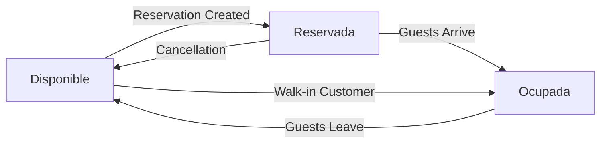

## Overview

The table management system provides complete control over restaurant tables, including status tracking, capacity management, and integration with the reservation system.

## Table Model

The Table model represents physical tables in the restaurant:

```php app/Models/Table.php
class Table extends Model
{
    use HasFactory;

    protected $fillable = [
        'name',
        'number',
        'type',
        'status',
        'seats',
    ];

    public function orders()
    {
        return $this->hasMany(Order::class);
    }
    
    public function reservation()
    {
        return $this->hasOne(Reservation::class);
    }
}
```

### Table Attributes

<ParamField path="name" type="string" required>
  Display name for the table (e.g., "Table 5", "Window Booth")
</ParamField>

<ParamField path="number" type="integer" required>
  Unique table number for identification (must be unique)
</ParamField>

<ParamField path="type" type="string" required>
  Type of table (e.g., "booth", "standard", "outdoor", "bar")
</ParamField>

<ParamField path="status" type="string" required>
  Current table status: `disponible`, `reservada`, or `ocupada`
</ParamField>

<ParamField path="seats" type="integer" required>
  Number of seats/capacity (minimum 1)
</ParamField>

## Table Relationships

### One-to-One with Reservations

```php
public function reservation()
{
    return $this->hasOne(Reservation::class);
}
```

<Note>
A table can have only one active reservation at a time. When assigned, the table status changes to 'reservada'.
</Note>

### One-to-Many with Orders

```php
public function orders()
{
    return $this->hasMany(Order::class);
}
```

## Table Status System

Tables can have three distinct statuses:

<Tabs>
  <Tab title="Disponible">
    **Available for use**
    - No active reservation
    - Not currently occupied
    - Can be assigned to new reservations
    - Can be seated immediately
  </Tab>
  <Tab title="Reservada">
    **Reserved for future guest**
    - Has an active reservation
    - Cannot be seated until reservation time
    - Linked to a Reservation record
    - Will change to 'ocupada' when guests arrive
  </Tab>
  <Tab title="Ocupada">
    **Currently occupied**
    - Guests are seated
    - Cannot accept new reservations
    - May have active orders
    - Will return to 'disponible' when cleared
  </Tab>
</Tabs>

## Table Controller

The TableController handles all table management operations.

### List All Tables

```php app/Http/Controllers/Admin/TableController.php
public function index()
{
    $tables = Table::orderBy('number')->paginate(20);
    return view('admin.tables', compact('tables'));
}
```

### Create New Table

```php app/Http/Controllers/Admin/TableController.php
public function store(Request $request)
{
    $data = $request->validate([
        'name'   => 'required|string|max:255',
        'number' => 'required|integer|unique:tables,number',
        'type'   => 'required|string|max:50',
        'seats'  => 'required|integer|min:1',
        'status' => 'required|string',
    ]);

    Table::create($data);

    return redirect()
        ->route('admin.tables.index')
        ->with('success', 'Mesa agregada correctamente.');
}
```

<Note type="warning">
**Unique Constraint**: The `number` field must be unique across all tables. Attempting to create a table with a duplicate number will fail validation.
</Note>

### Update Table

```php app/Http/Controllers/Admin/TableController.php
public function update(Request $request, Table $table)
{
    $data = $request->validate([
        'name'   => 'required|string|max:255',
        'number' => 'required|integer|unique:tables,number,' . $table->id,
        'type'   => 'required|string|max:50',
        'seats'  => 'required|integer|min:1',
        'status' => 'required|string',
    ]);

    $table->update($data);

    return redirect()
        ->route('admin.tables.index')
        ->with('success', 'Mesa actualizada correctamente.');
}
```

<Accordion title="Unique Validation on Update">
The validation rule `unique:tables,number,' . $table->id` ensures the table number is unique **except** for the current table being updated. This allows keeping the same number during updates.
</Accordion>

### Delete Table

```php app/Http/Controllers/Admin/TableController.php
public function destroy(Table $table)
{
    $table->delete();
    return redirect()
        ->route('admin.tables.index')
        ->with('success', 'Mesa eliminada correctamente.');
}
```

## Mark Table as Used

Special endpoint to mark reserved tables as available after guest departure:

```php app/Http/Controllers/Admin/TableController.php
public function markAsUsed($id)
{
    $table = Table::findOrFail($id);

    if ($table->status !== 'reservada') {
        return response()->json([
            'success' => false, 
            'message' => 'La mesa no está reservada.'
        ]);
    }

    // Delete reservation if relation exists
    if (method_exists($table, 'reservation') && $table->reservation) {
        $table->reservation()->delete();
    }

    $table->update(['status' => 'disponible']);

    return response()->json([
        'success' => true, 
        'message' => 'Mesa marcada como utilizada.'
    ]);
}
```

<Accordion title="Reservation Cleanup">
When marking a table as used, the system:
1. Verifies the table is in 'reservada' status
2. Deletes the associated reservation record
3. Changes status back to 'disponible'
4. Makes the table available for new reservations
</Accordion>

## Update Table Status from HomeController

The HomeController provides an additional method for status updates:

```php app/Http/Controllers/HomeController.php
public function updateStatus(Request $request, Table $table)
{
    $data = $request->validate([
        'status' => 'required|string|in:disponible,reservada,ocupada'
    ]);

    $table->update(['status' => $data['status']]);

    return redirect()
        ->back()
        ->with('success', 'Estado de la mesa actualizado correctamente.');
}
```

<Note>
The validation rule `in:disponible,reservada,ocupada` ensures only valid status values can be set.
</Note>

## Routes and Access Control

Table management routes are restricted to admin and mesero roles:

```php routes/web.php
Route::middleware('role:admin,mesero')->group(function () {
    Route::resource('tables', AdminTableController::class)
        ->names('tables');
    
    Route::post('tables/{table}/mark-as-used', [
        AdminTableController::class, 'markAsUsed'
    ])->name('tables.markAsUsed');
});
```

**Access Permissions:**
- ✅ Admin: Full CRUD access
- ✅ Mesero: Full CRUD access
- ❌ Chef: No access
- ❌ Customers: No access

## Status Workflow

Typical table lifecycle:



<Accordion title="Status Transitions">
  **Disponible → Reservada**
  - Triggered when reservation is assigned
  - Sets `table_id` on Reservation model
  
  **Reservada → Ocupada**
  - Manual update when guests arrive
  - Table still linked to reservation
  
  **Ocupada → Disponible**
  - Manual update after service complete
  - Table ready for next use
  
  **Reservada → Disponible**
  - Via `markAsUsed()` endpoint
  - Deletes reservation record
</Accordion>

## Validation Rules

<ParamField path="name" type="string">
  **Required**, max 255 characters
</ParamField>

<ParamField path="number" type="integer">
  **Required**, must be unique across all tables
</ParamField>

<ParamField path="type" type="string">
  **Required**, max 50 characters (e.g., "booth", "standard")
</ParamField>

<ParamField path="seats" type="integer">
  **Required**, minimum value of 1
</ParamField>

<ParamField path="status" type="enum">
  **Required**, must be one of: `disponible`, `reservada`, `ocupada`
</ParamField>

## Common Queries

```php
// Get all available tables
$available = Table::where('status', 'disponible')->get();

// Get tables by capacity
$fourSeaters = Table::where('seats', 4)->get();

// Get reserved tables with reservation details
$reserved = Table::with('reservation')
    ->where('status', 'reservada')
    ->get();

// Get tables by type
$booths = Table::where('type', 'booth')->get();

// Count tables by status
$statusCounts = Table::selectRaw('status, COUNT(*) as count')
    ->groupBy('status')
    ->get();

// Get occupied tables with active orders
$occupied = Table::with('orders')
    ->where('status', 'ocupada')
    ->get();

// Find tables that can accommodate party size
$suitableTables = Table::where('seats', '>=', $partySize)
    ->where('status', 'disponible')
    ->orderBy('seats', 'asc')
    ->get();
```

## API Endpoints

<Accordion title="Mark as Used API">
  **Endpoint**: `POST /admin/tables/{table}/mark-as-used`
  
  **Success Response**:
  ```json
  {
    "success": true,
    "message": "Mesa marcada como utilizada."
  }
  ```
  
  **Error Response**:
  ```json
  {
    "success": false,
    "message": "La mesa no está reservada."
  }
  ```
</Accordion>

## Best Practices

1. **Unique Numbers**: Always use unique table numbers for clear identification
2. **Status Validation**: Only allow valid status transitions
3. **Reservation Cleanup**: Delete reservations when marking tables as used
4. **Capacity Matching**: Match table seats to reservation guest count
5. **Ordering**: Display tables ordered by number for easy navigation
6. **Type Consistency**: Use consistent type values (booth, standard, etc.)
7. **Pagination**: Paginate table lists for large restaurants

## Integration with Reservations

When a reservation is assigned to a table:

```php
// In ReservationController::assignTable()
DB::transaction(function () use ($reservation, $table) {
    // Link reservation to table
    $reservation->table_id = $table->id;
    $reservation->save();

    // Update table status
    $table->status = 'reservada';
    $table->save();
});
```

<Note type="info">
The system enforces that `reservation->guest` must equal `table->seats` for assignment to succeed.
</Note>

## Future Enhancements

Consider implementing:
- **Table sections**: Group tables by area (patio, main dining, bar)
- **Auto-release**: Automatically free tables after reservation time expires
- **Occupancy tracking**: Track time guests spend at tables
- **Table combinations**: Allow combining multiple tables for large parties
- **Priority seating**: VIP or priority customer table assignments