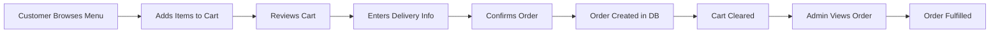

## Introduction

This quickstart guide walks you through the essential steps to get your restaurant site operational, from logging in as an admin to processing your first customer order.

<Note>
  Before starting, ensure you've completed the [Installation](/installation) guide and have the application running at `http://localhost:8000`
</Note>

## Overview

In this guide, you'll:

1. Log in as an admin user
2. Create food categories
3. Add menu items with details
4. Test the customer ordering flow
5. Manage orders in the admin panel

## Step-by-Step Guide

<Steps>
  <Step title="Access the Application">
    Open your browser and navigate to the application:
    
    ```bash
    http://localhost:8000
    ```
    
    You should see the restaurant homepage with a navigation menu.
  </Step>

  <Step title="Log in as Admin">
    Click the **Login** button in the navigation menu and use the seeded admin credentials:
    
    ```yaml
    Email: admin@gmail.com
    Password: admin1234
    ```
    
    After successful login, you'll be redirected to the admin dashboard at `/admin/dashboard`.
    
    <Tip>
      The system uses Laravel Jetstream for authentication, which includes features like two-factor authentication and session management.
    </Tip>
  </Step>

  <Step title="Explore the Admin Dashboard">
    The admin dashboard provides access to:
    
    - **Users Management** - Create and manage staff accounts
    - **Food Menu** - Add and edit menu items
    - **Categories** - Organize menu items
    - **Tables** - Manage restaurant tables
    - **Reservations** - Handle table bookings
    - **Orders** - View and process customer orders
    - **Chefs** - Manage chef profiles
    
    Navigate through the sidebar to familiarize yourself with the interface.
  </Step>

  <Step title="Create Menu Categories">
    Before adding food items, create some categories:
    
    1. Go to **Admin > Categories** (or use the existing seeded categories)
    2. Click **Add Category**
    3. Create categories like:
       - Appetizers
       - Main Courses
       - Desserts
       - Beverages
       - Specials
    
    <Note>
      Categories are automatically seeded during installation via `CategorySeeder`, but you can add more as needed.
    </Note>
  </Step>

  <Step title="Add Your First Menu Item">
    Now add a food item to the menu:
    
    1. Navigate to **Admin > Foods** in the sidebar
    2. Click **Create Food** or **Add New Item**
    3. Fill in the details:
    
    ```yaml
    Title: Grilled Salmon
    Price: 24.99
    Category: Main Courses
    Description: Fresh Atlantic salmon grilled to perfection
    Ingredients: Salmon, olive oil, lemon, herbs
    Proteins: 35g
    Calories: 450
    Size: 250g
    Image: Upload an image (optional)
    ```
    
    4. Click **Save** to create the item
    
    The food item is stored in the `food` table:
    
    ```php
    Schema::create('food', function (Blueprint $table) {
        $table->id();
        $table->string("title")->nullable();
        $table->decimal('price', 8, 2)->nullable();
        $table->string("image")->nullable();
        $table->string("description")->nullable();
        $table->text('ingredients')->nullable();
        $table->string('proteins')->nullable();
        $table->integer('calories')->nullable();
        $table->string('size')->nullable();
        $table->foreignId('category_id')
              ->nullable()
              ->constrained('categories')
              ->onDelete('set null');
        $table->timestamps();
    });
    ```
  </Step>

  <Step title="Add More Menu Items">
    Create a few more items to populate your menu:
    
    <CodeGroup>
    ```yaml Appetizer Example
    Title: Caesar Salad
    Price: 8.99
    Category: Appetizers
    Description: Classic Caesar with crispy romaine
    Ingredients: Romaine lettuce, Caesar dressing, parmesan, croutons
    Calories: 220
    Size: Medium
    ```
    
    ```yaml Dessert Example
    Title: Chocolate Lava Cake
    Price: 7.99
    Category: Desserts
    Description: Warm chocolate cake with molten center
    Ingredients: Dark chocolate, butter, eggs, sugar, flour
    Calories: 380
    Size: Individual
    ```
    
    ```yaml Beverage Example
    Title: Fresh Lemonade
    Price: 3.99
    Category: Beverages
    Description: House-made lemonade with fresh lemons
    Ingredients: Lemons, sugar, water, ice
    Calories: 120
    Size: 16oz
    ```
    </CodeGroup>
  </Step>

  <Step title="Test the Customer Experience">
    Now test the ordering flow from a customer's perspective:
    
    1. **Log out** from the admin account
    2. **Register a new customer account** or use the seeded customer:
       ```yaml
       Email: user@gmail.com
       Password: user1234
       ```
    3. You'll be redirected to the homepage
  </Step>

  <Step title="Browse the Menu">
    As a customer:
    
    1. Click **Menu** in the navigation
    2. Browse the food items you created
    3. Click on an item to view details
    
    The menu view is powered by the `comidaview` route:
    
    ```php routes/web.php
    Route::get('/menu', [HomeController::class, 'comidaview'])->name('menu');
    ```
    
    ```php HomeController.php
    public function comidaview()
    {
        $foods = Food::with('category')->paginate(24);
        $user = Auth::user();
        $count = $user ? Cart::where('user_id', $user->id)->count() : 0;
        
        return view('comidaview', compact('foods','count'));
    }
    ```
  </Step>

  <Step title="Add Items to Cart">
    Select items and add them to your cart:
    
    1. Click on a food item (e.g., "Grilled Salmon")
    2. View the detailed information
    3. Click **Add to Cart**
    4. The cart count in the navigation will update
    
    The cart is managed through authenticated routes:
    
    ```php routes/web.php
    Route::middleware(['auth'])->group(function () {
        Route::get('/cart', [CartController::class, 'index'])->name('cart.index');
        Route::post('/cart/{food}', [CartController::class, 'store'])->name('cart.store');
        Route::delete('/cart/{cart}', [CartController::class, 'destroy'])->name('cart.destroy');
    });
    ```
    
    <Note>
      Only authenticated users can add items to cart. Guest users will be redirected to login.
    </Note>
  </Step>

  <Step title="View and Update Cart">
    Check your cart:
    
    1. Click the **Cart** icon in the navigation
    2. Review the items and quantities
    3. Update quantities or remove items as needed
    4. See the total price update dynamically
  </Step>

  <Step title="Place an Order">
    Complete the checkout process:
    
    1. From the cart page, click **Proceed to Checkout**
    2. Fill in delivery details:
       ```yaml
       Name: John Doe
       Phone: +1 (555) 123-4567
       Address: 123 Main St, Apt 4B, New York, NY 10001
       ```
    3. Review your order items
    4. Click **Confirm Order**
    
    The order is processed by the `orderConfirm` method:
    
    ```php HomeController.php
    public function orderConfirm(Request $request)
    {
        $request->validate([
            'name' => 'required|string|max:255',
            'phone' => 'required|string|max:40',
            'address' => 'nullable|string',
        ]);
        
        $user = Auth::user();
        
        DB::beginTransaction();
        try {
            $order = Order::create([
                'user_id' => $user ? $user->id : null,
                'customer_name' => $request->name,
                'phone' => $request->phone,
                'address' => $request->address,
                'total' => 0,
                'status' => 'pending',
            ]);
            
            $total = 0;
            foreach ($normalized as $it) {
                $orderItem = $order->items()->create([
                    'food_id' => $it['food_id'] ?? null,
                    'title'   => $it['title'],
                    'price'   => $it['price'],
                    'quantity'=> $it['quantity'],
                    'subtotal'=> $it['subtotal'],
                ]);
                $total += $it['subtotal'];
            }
            
            $order->update(['total' => $total]);
            
            // Clear cart items
            if ($user) {
                Cart::where('user_id', $user->id)->delete();
            }
            
            DB::commit();
            return redirect()->route('home')
                ->with('success', 'Order created successfully. ID: ' . $order->id);
        } catch (\Throwable $e) {
            DB::rollBack();
            return redirect()->back()
                ->with('error', 'Could not process order. Please try again.');
        }
    }
    ```
    
    <Tip>
      Orders are created in a database transaction to ensure data consistency. If any part fails, all changes are rolled back.
    </Tip>
  </Step>

  <Step title="View Orders as Admin">
    Switch back to the admin account to manage orders:
    
    1. Log out from the customer account
    2. Log in as admin (`admin@gmail.com` / `admin1234`)
    3. Go to **Admin > Orders**
    4. You'll see the order you just placed
    5. Click to view order details:
       - Customer information
       - Order items with quantities
       - Total amount
       - Order status (pending, preparing, delivered)
    
    The orders route is protected by role middleware:
    
    ```php routes/web.php
    Route::middleware('role:admin')->group(function () {
        Route::get('orders', [AdminOrderController::class, 'index'])
            ->name('orders.index');
        Route::get('orders/{order}', [AdminOrderController::class, 'show'])
            ->name('orders.show');
    });
    ```
  </Step>

  <Step title="Test Other User Roles">
    Explore the different role capabilities:
    
    **Chef Account** (`chef@gmail.com` / `chef1234`):
    - Access admin panel
    - Manage food menu items
    - View chef profile
    - Cannot access user management
    
    ```php routes/web.php
    Route::middleware('role:admin,chef')->group(function () {
        Route::resource('foods', AdminFoodController::class)->names('foods');
    });
    ```
    
    **Waiter Account** (`mesero@gmail.com` / `mesero1234`):
    - Access admin panel
    - Manage tables and reservations
    - Assign tables to customers
    - Cannot manage menu items
    
    ```php routes/web.php
    Route::middleware('role:admin,mesero')->group(function () {
        Route::resource('tables', AdminTableController::class)->names('tables');
        Route::get('reservations', [AdminReservationController::class, 'index']);
    });
    ```
  </Step>

  <Step title="Manage Tables (Optional)">
    If you're running a dine-in restaurant:
    
    1. Log in as admin or waiter
    2. Go to **Admin > Tables**
    3. Click **Add Table**
    4. Create tables:
       ```yaml
       Table Number: 1
       Capacity: 4
       Status: Available
       Location: Window Side
       ```
    5. Repeat for multiple tables
    6. Update table status as customers arrive:
       - Available
       - Reserved
       - Occupied
  </Step>
</Steps>

## Understanding the Data Flow

### Order Processing Flow



### Role-Based Access

The system uses Spatie Laravel Permission for role management:

```php User Model
use Spatie\Permission\Traits\HasRoles;

class User extends Authenticatable
{
    use HasRoles;
    
    // Check if user has a role
    if ($user->hasRole('admin')) {
        // Admin access
    }
    
    // Check multiple roles
    if ($user->hasAnyRole(['admin', 'chef', 'mesero'])) {
        // Access admin panel
    }
}
```

### Database Relationships

```php
// Food belongs to Category
Food::with('category')->get();

// Order has many OrderItems
$order = Order::with('items')->find(1);

// User has many Orders
$userOrders = User::find(1)->orders;

// Cart belongs to User and Food
$cartItems = Cart::with('food', 'user')->get();
```

## Configuration Tips

### Customize Application Name

Update your `.env` file:

```bash .env
APP_NAME="My Restaurant Name"
VITE_APP_NAME="${APP_NAME}"
```

### Set Application URL

```bash .env
APP_URL=http://myrestaurant.test
```

### Configure File Uploads

For food images, ensure storage is properly linked:

```bash
php artisan storage:link
```

Images are stored in `storage/app/public/` and accessed via `public/storage/`.

## Common Tasks

### Create a New Admin User

```bash
php artisan tinker
```

```php
$user = User::create([
    'name' => 'New Admin',
    'email' => 'newadmin@restaurant.com',
    'password' => Hash::make('secure-password'),
    'usertype' => 'admin'
]);

$user->assignRole('admin');
```

### Bulk Import Menu Items

Create a custom seeder:

```php database/seeders/MenuSeeder.php
use App\Models\Food;
use App\Models\Category;

class MenuSeeder extends Seeder
{
    public function run()
    {
        $appetizers = Category::where('name', 'Appetizers')->first();
        
        $items = [
            ['title' => 'Spring Rolls', 'price' => 6.99, 'calories' => 180],
            ['title' => 'Bruschetta', 'price' => 7.99, 'calories' => 150],
            ['title' => 'Calamari', 'price' => 9.99, 'calories' => 280],
        ];
        
        foreach ($items as $item) {
            Food::create([
                ...$item,
                'category_id' => $appetizers->id,
                'description' => 'Delicious ' . $item['title'],
            ]);
        }
    }
}
```

Run the seeder:

```bash
php artisan db:seed --class=MenuSeeder
```

### Clear All Orders (Development)

```bash
php artisan tinker
```

```php
Order::truncate();
OrderItem::truncate();
Cart::truncate();
```

<Warning>
  Only use truncate in development. In production, use soft deletes or archive old orders.
</Warning>

## Testing the API

If you plan to use the API endpoints:

### Authenticate with Sanctum

```bash
curl -X POST http://localhost:8000/login \
  -H "Content-Type: application/json" \
  -d '{
    "email": "admin@gmail.com",
    "password": "admin1234"
  }'
```

### Fetch Menu Items

```bash
curl http://localhost:8000/api/foods \
  -H "Authorization: Bearer YOUR_TOKEN"
```

## Next Steps

Now that you have a working restaurant site:

<CardGroup cols={2}>
  <Card title="Authentication Guide" icon="lock" href="/features/authentication">
    Deep dive into the multi-role authentication system
  </Card>
  
  <Card title="Menu Management" icon="utensils" href="/features/menu-management">
    Learn advanced menu management features
  </Card>
  
  <Card title="Order Processing" icon="receipt" href="/features/orders">
    Understand the complete order workflow
  </Card>
  
  <Card title="Configuration" icon="palette" href="/guides/configuration">
    Customize the configuration of your restaurant site
  </Card>
</CardGroup>

## Troubleshooting

<AccordionGroup>
  <Accordion title="Cannot Add Items to Cart">
    **Issue**: "Please login to add items to cart" message
    
    **Solution**: Cart functionality requires authentication. Ensure you're logged in:
    ```php
    // Cart routes require auth middleware
    Route::middleware(['auth'])->group(function () {
        Route::post('/cart/{food}', [CartController::class, 'store']);
    });
    ```
  </Accordion>

  <Accordion title="Order Confirmation Fails">
    **Issue**: Order not created, transaction rolled back
    
    **Possible Causes**:
    - Missing required fields (name, phone)
    - Food item doesn't exist
    - Database connection issue
    
    **Debug**:
    ```bash
    # Check Laravel logs
    tail -f storage/logs/laravel.log
    
    # Test database connection
    php artisan db:show
    ```
  </Accordion>

  <Accordion title="Role Middleware Blocking Access">
    **Issue**: Redirected when accessing admin routes
    
    **Solution**: Verify user has correct role assigned:
    ```bash
    php artisan tinker
    ```
    
    ```php
    $user = User::where('email', 'your@email.com')->first();
    $user->roles; // Check assigned roles
    $user->assignRole('admin'); // Assign role if missing
    ```
  </Accordion>

  <Accordion title="Images Not Displaying">
    **Issue**: Food images showing broken links
    
    **Solution**:
    ```bash
    # Ensure storage is linked
    php artisan storage:link
    
    # Check file permissions
    chmod -R 775 storage/app/public
    
    # Verify image path in database
    # Should be: storage/foods/filename.jpg
    ```
  </Accordion>
</AccordionGroup>

<Tip>
  For production deployment, remember to:
  - Set `APP_ENV=production`
  - Set `APP_DEBUG=false`
  - Run `php artisan config:cache`
  - Run `php artisan route:cache`
  - Run `php artisan view:cache`
  - Use `npm run build` for optimized assets
</Tip>